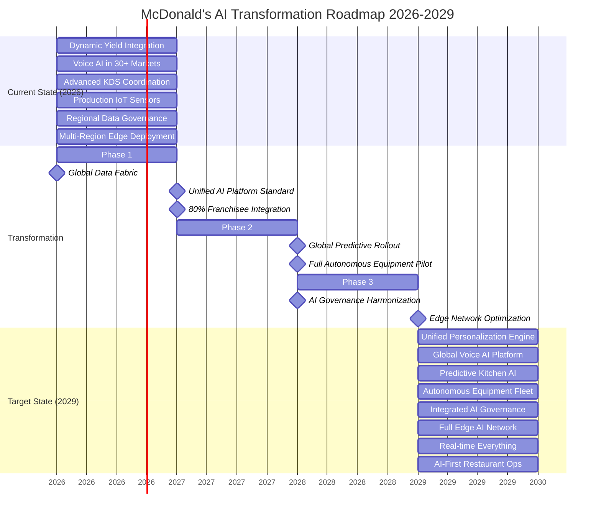
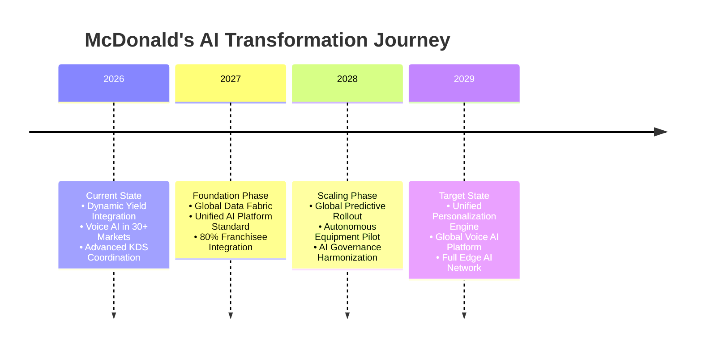

# Enterprise Architecture for McDonald's AI & Data-Driven Transformation: A Principal Architect's Strategic Blueprint

## Executive Summary

##### McDonald's stands at a critical inflection point in its digital transformation journey. As a global restaurant chain serving 69 million customers daily across 40,000+ locations, the company's transition from fast food to fast-tech requires a deliberate enterprise architecture approach. This comprehensive guide outlines how strategic business capability modeling enables McDonald's to systematically align its AI/ML ambitions—from hyper-personalization to automated kitchens—with executable technology roadmaps, ensuring measurable business outcomes and sustained competitive advantage in the QSR industry.

---

## 1. The Strategic Imperative: Business Capability Modeling for McDonald's AI Revolution

### 1.1 McDonald's-Specific Capability Challenges

##### Based on McDonald's technical blog and public disclosures, the organization faces unique capability challenges:

- Global-Local Tension: Balancing centralized AI platforms with franchisee autonomy

- Real-time Complexity: Processing millions of transactions hourly across disparate systems

- Edge Computing Demands: Kitchen automation and drive-thru AI requiring low-latency processing

- Data Silos: Historical separation between POS, supply chain, mobile app, and kitchen systems

- Regulatory Diversity: 100+ countries with varying data privacy and AI regulations


```python
LEFT SIDE: CURRENT STATE (2026)                     RIGHT SIDE: TARGET STATE (2029)
┌────────────────────────────────────────────┐     ┌────────────────────────────────────────────┐
│    CURRENT CAPABILITIES                    │     │    TARGET CAPABILITIES                     │
│    • Silos: POS ≠ Mobile ≠ Supply Chain    │     │    • Unified Customer 360° View            │
│    • Basic Personalization (Dynamic Yield) │     │    • Predictive Kitchen Operations         │
│    • Limited Edge AI (Pilot Programs)      │     │    • Full Edge AI Deployment               │
│    • Manual Operations Dominant            │     │    • Autonomous Restaurant Elements        │
│    • Fragmented Data Governance            │     │    • Integrated Data/AI Governance         │
└────────────────────────────────────────────┘     └────────────────────────────────────────────┘
                        ▲                                        ▲
                        │                                        │
                        └────────── TRANSFORMATION ──────────────┘
                                 ARCHITECTURE ROADMAP
```


### *Figure 1: McDonald's current and target AI/Data capability landscape*


### *Figure 2: McDonald's target AI/Data capability landscape*


# 🍟 MCDONALD'S AI CAPABILITY ECOSYSTEM 2026 → 2029



# 🍟 MCDONALD'S AI CAPABILITY ECOSYSTEM 2026 → 2029




# 🍟 MCDONALD'S AI CAPABILITY ECOSYSTEM 2026 → 2029

## 📅 Transformation Timeline

| Year | Phase | Key Initiatives | Expected Outcomes |
|------|-------|-----------------|-------------------|
| **2026** | **Current State** | • Dynamic Yield fully integrated<br>• Voice AI expanded to 30+ markets<br>• Production IoT sensors deployed<br>• Regional edge computing established | Foundation for global AI expansion |
| **2027** | **Foundation** | • Global data fabric implementation<br>• Unified AI platform standardization<br>• 80% franchisee system integration | Single source of truth, standardized platforms |
| **2028** | **Scale** | • Global predictive AI rollout<br>• Autonomous equipment pilots<br>• AI governance framework harmonization | AI-driven operations at scale |
| **2029** | **Target State** | • Unified personalization engine<br>• Full edge AI network deployment<br>• AI-first restaurant operations | Fully integrated, autonomous AI ecosystem |

##  Target State (2029) Capabilities
- **Unified Personalization Engine:** Real-time customer preference prediction
- **Global Voice AI Platform:** Consistent multilingual customer experience
- **Predictive Kitchen AI:** Proactive inventory and preparation optimization
- **Autonomous Equipment Fleet:** Self-optimizing kitchen equipment
- **Integrated AI Governance:** Global compliance and ethics framework
- **Full Edge AI Network:** Real-time processing in every restaurant
- **AI-First Restaurant Ops:** Complete AI-driven operations lifecycle


## 2. Integrating Business Capability Models with McDonald's Architecture

##### For McDonald's global scale and franchise-based operational model, traditional enterprise architecture frameworks require significant adaptation. The integration of business capability models with McDonald's architecture must address the unique tension between centralized efficiency and local autonomy, while enabling scalable AI deployment across 40,000+ diverse locations.

### 2.1 McDonald's-Specific TOGAF ADM Adaptation

##### McDonald's requires a modified TOGAF Architecture Development Method (ADM) that incorporates franchisee engagement cycles and market-specific compliance checkpoints. This adaptation transforms the standard ADM into a federated architecture approach, where global AI platforms support local customization while maintaining core governance standards across all markets.


```python
┌─────────────────────────────────────────────────────────────────────────────┐
│                       🍟  TOGAF ADM for McDonald's AI                       │
├─────────────────────────────────────────────────────────────────────────────┤
│                                                                             │
│  ┌─────────────────┐    ┌─────────────────┐    ┌─────────────────┐          │
│  │  Preliminary:   │    │   Phase A:      │    │  Phase B:       │          │
│  │  Digital Vision │────▶│  Architecture │────▶│  Business      │          │
│  │  & Strategy     │    │  Vision         │    │  Architecture   │          │
│  │                 │    │  QSR AI         │    │  Restaurant Ops │          │
│  │                 │    │  Business Case  │    │  Capabilities   │          │
│  └─────────────────┘    └─────────────────┘    └─────────────────┘          │
│                                                                             │
│  ┌─────────────────┐    ┌─────────────────┐    ┌─────────────────┐          │
│  │  Phase C:       │    │  Phase D:       │    │  Phase E:       │          │
│  │  Information    │────▶│ Technology     │────▶│ Opportunities │          │
│  │  Systems        │    │  Architecture   │    │  & Solutions    │          │
│  │  Global Data    │    │  Edge AI        │    │  Kitchen        │          │
│  │  Lake           │    │  Platform       │    │  Automation     │          │
│  └─────────────────┘    └─────────────────┘    └─────────────────┘          │
│                                                                             │
│  ┌─────────────────┐    ┌─────────────────┐    ┌─────────────────┐          │
│  │  Phase F:       │    │  Phase G:       │    │  Phase H:       │          │
│  │  Migration      │────▶│  Implementation │────▶│  Architecture  │────────┘
│  │  Planning       │    │  Model          │    │  Change         │          │
│  │  Franchisee     │    │  Deployment to  │    │  Continuous     │          │
│  │  Rollout        │    │  40K Locations  │    │  Menu Optimiz.  │          │
│  └─────────────────┘    └─────────────────┘    └─────────────────┘          │
│                                                                             │
└─────────────────────────────────────────────────────────────────────────────┘

```

---

### 2.2 ArchiMate EA Model for McDonald's Restaurant Technology Stack & Roadmap

```python
┌─────────────────────────────────────────────────────────────────────────────┐
│                  ARCHIMATE EA MODEL: McDonald's Restaurant Tech Stack       │
├─────────────────────────────────────────────────────────────────────────────┤
│                                                                             │
│  ┌──────────────────────────────────────────────────────────────────────┐   │
│  │                        BUSINESS LAYER                                │   │
│  │  ┌──────────────────────────────────────────────────────────────┐    │   │
│  │  │  Business Capabilities & Value Streams                       │    │   │
│  │  │  • Hyper-Personalized Customer Experience                    │    │   │
│  │  │  • Optimized Kitchen Throughput & Efficiency                 │    │   │
│  │  │  • Predictive Supply Chain Management                        │    │   │
│  │  │  • Automated Restaurant Operations                           │    │   │
│  │  │  • Franchisee Business Intelligence                          │    │   │
│  │  └──────────────────────────────────────────────────────────────┘    │   │
│  └──────────────────────────────────────────────────────────────────────┘   │
│                                    ▲ realizes                               │
│                                    │                                        │
│  ┌──────────────────────────────────────────────────────────────────────┐   │
│  │                      APPLICATION LAYER                               │   │
│  │  ┌──────────────────────────────────────────────────────────────┐    │   │
│  │  │  Application Components & Services                           │    │   │
│  │  │  • Dynamic Menu Engine & Pricing System                      │    │   │
│  │  │  • AI Drive-Thru Assistant (Voice/NLP)                       │    │   │
│  │  │  • Smart Kitchen Orchestrator & KDS                          │    │   │
│  │  │  • Predictive Maintenance System                             │    │   │
│  │  │  • Franchisee Performance Dashboard                          │    │   │
│  │  │  • Global Mobile App & Loyalty Platform                      │    │   │
│  │  └──────────────────────────────────────────────────────────────┘    │   │
│  └──────────────────────────────────────────────────────────────────────┘   │
│                          ▲ deployed on        ▲ uses                        │
│                          │                    │                             │
│  ┌──────────────────────────────────────────────────────────────────────┐   │
│  │                      TECHNOLOGY LAYER                                │   │
│  │  ┌──────────────────────────────────────────────────────────────┐    │   │
│  │  │  Technology Services & Infrastructure                        │    │   │
│  │  │  • Global Feature Store (Customer Preferences)               │    │   │
│  │  │  • Edge AI Inference (NVIDIA GPUs at Restaurants)            │    │   │
│  │  │  • Real-time Data Pipeline (Apache Kafka)                    │    │   │
│  │  │  • Model Registry & MLflow                                   │    │   │
│  │  │  • IoT Gateway & Edge Computing                              │    │   │
│  │  │  • API Gateway & Microservices                               │    │   │
│  │  └──────────────────────────────────────────────────────────────┘    │   │
│  └──────────────────────────────────────────────────────────────────────┘   │
│                                    ▲ hosted on                              │
│                                    │                                        │
│  ┌──────────────────────────────────────────────────────────────────────┐   │
│  │                        PHYSICAL LAYER                                │   │
│  │  ┌──────────────────────────────────────────────────────────────┐    │   │
│  │  │  Physical Infrastructure & Devices                           │    │   │
│  │  │  • Restaurant POS Systems (NCR, Square, etc.)                │    │   │
│  │  │  • Kitchen Automation Hardware & Robotics                    │    │   │
│  │  │  • Drive-Thru Sensors, Cameras & Audio                       │    │   │
│  │  │  • Cloud Regions (GCP/AWS per market compliance)             │    │   │
│  │  │  • Edge Computing Devices (Restaurant Servers)               │    │   │
│  │  └──────────────────────────────────────────────────────────────┘    │   │
│  └──────────────────────────────────────────────────────────────────────┘   │
│                                                                             │
├─────────────────────────────────────────────────────────────────────────────┤
│  Legend: ◉ Business Process  ◉ Application Service  ◉ Technology Component│
│          ◉ Physical Device   ───▶ realizes          ───▶ deployed on      │
└────────────────────────────────────────────────────────────────────────────┘

````
Figure: ArchiMate layered architecture showing McDonald's technology stack from business capabilities to physical implementation


