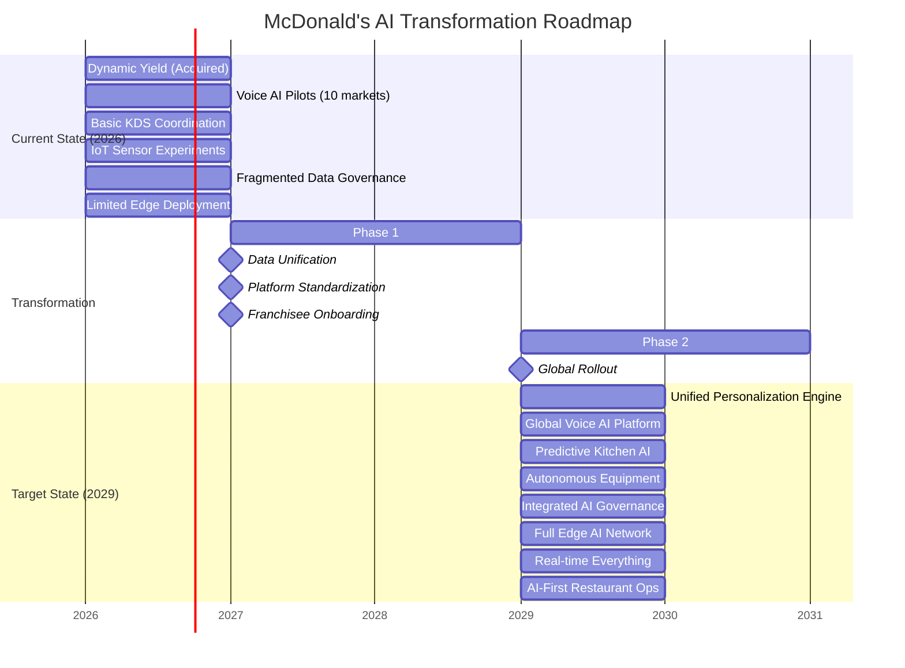
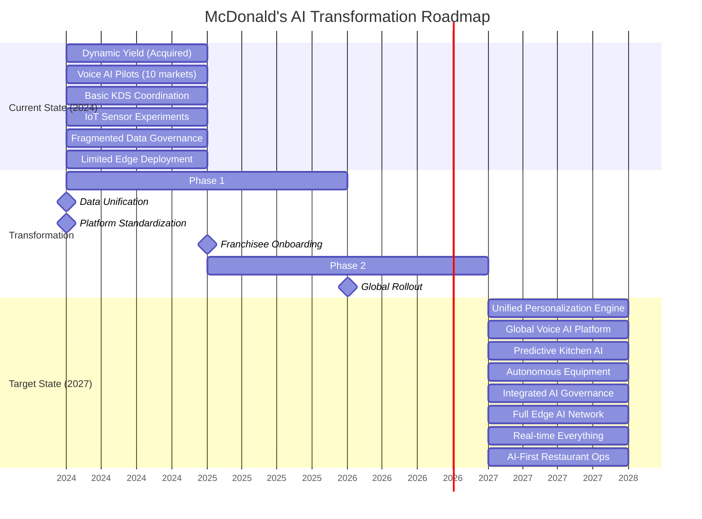

# Enterprise Architecture for McDonald's AI & Data-Driven Transformation: A Principal Architect's Strategic Blueprint

## Executive Summary

##### McDonald's stands at a critical inflection point in its digital transformation journey. As a global restaurant chain serving 69 million customers daily across 40,000+ locations, the company's transition from fast food to fast-tech requires a deliberate enterprise architecture approach. This comprehensive guide outlines how strategic business capability modeling enables McDonald's to systematically align its AI/ML ambitions—from hyper-personalization to automated kitchens—with executable technology roadmaps, ensuring measurable business outcomes and sustained competitive advantage in the QSR industry.

---

## 1. The Strategic Imperative: Business Capability Modeling for McDonald's AI Revolution

### 1.1 McDonald's-Specific Capability Challenges

##### Based on McDonald's technical blog and public disclosures, the organization faces unique capability challenges:

- Global-Local Tension: Balancing centralized AI platforms with franchisee autonomy

- Real-time Complexity: Processing millions of transactions hourly across disparate systems

- Edge Computing Demands: Kitchen automation and drive-thru AI requiring low-latency processing

- Data Silos: Historical separation between POS, supply chain, mobile app, and kitchen systems

- Regulatory Diversity: 100+ countries with varying data privacy and AI regulations


```python
LEFT SIDE: CURRENT STATE (2024)                     RIGHT SIDE: TARGET STATE (2027)
┌────────────────────────────────────────────┐     ┌────────────────────────────────────────────┐
│    CURRENT CAPABILITIES                    │     │    TARGET CAPABILITIES                     │
│    • Silos: POS ≠ Mobile ≠ Supply Chain    │     │    • Unified Customer 360° View            │
│    • Basic Personalization (Dynamic Yield) │     │    • Predictive Kitchen Operations         │
│    • Limited Edge AI (Pilot Programs)      │     │    • Full Edge AI Deployment               │
│    • Manual Operations Dominant            │     │    • Autonomous Restaurant Elements        │
│    • Fragmented Data Governance            │     │    • Integrated Data/AI Governance         │
└────────────────────────────────────────────┘     └────────────────────────────────────────────┘
                        ▲                                        ▲
                        │                                        │
                        └────────── TRANSFORMATION ──────────────┘
                                 ARCHITECTURE ROADMAP
```


### *Figure 1: McDonald's current and target AI/Data capability landscape*


### *Figure 2: McDonald's target AI/Data capability landscape*


### 🍟 MCDONALD'S AI CAPABILITY ECOSYSTEM 2026 → 2029



# 🍟 MCDONALD'S AI CAPABILITY ECOSYSTEM 2024 → 2027




## 2. Integrating Business Capability Models with McDonald's Architecture

##### For McDonald's global scale and franchise-based operational model, traditional enterprise architecture frameworks require significant adaptation. The integration of business capability models with McDonald's architecture must address the unique tension between centralized efficiency and local autonomy, while enabling scalable AI deployment across 40,000+ diverse locations.

### 2.1 McDonald's-Specific TOGAF ADM Adaptation

##### McDonald's requires a modified TOGAF Architecture Development Method (ADM) that incorporates franchisee engagement cycles and market-specific compliance checkpoints. This adaptation transforms the standard ADM into a federated architecture approach, where global AI platforms support local customization while maintaining core governance standards across all markets.


