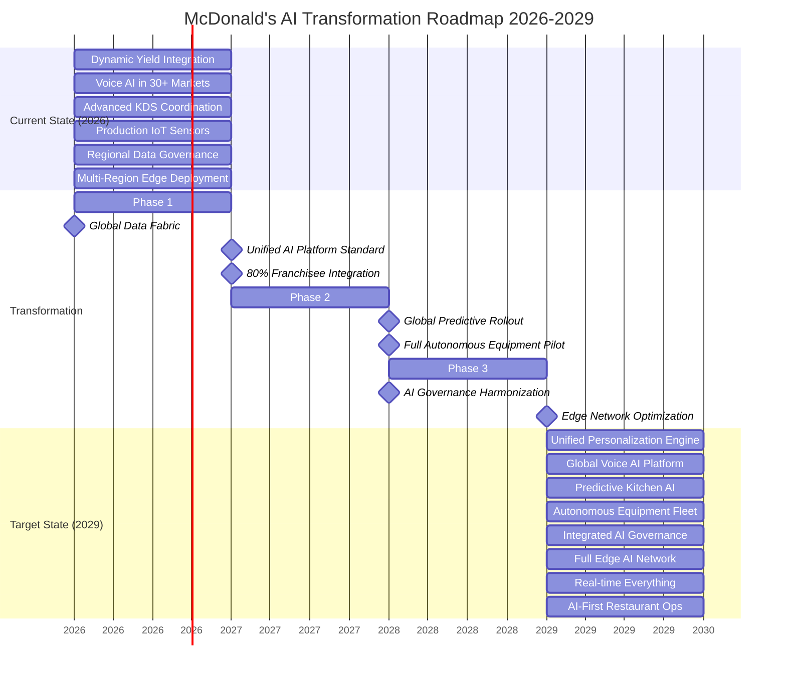
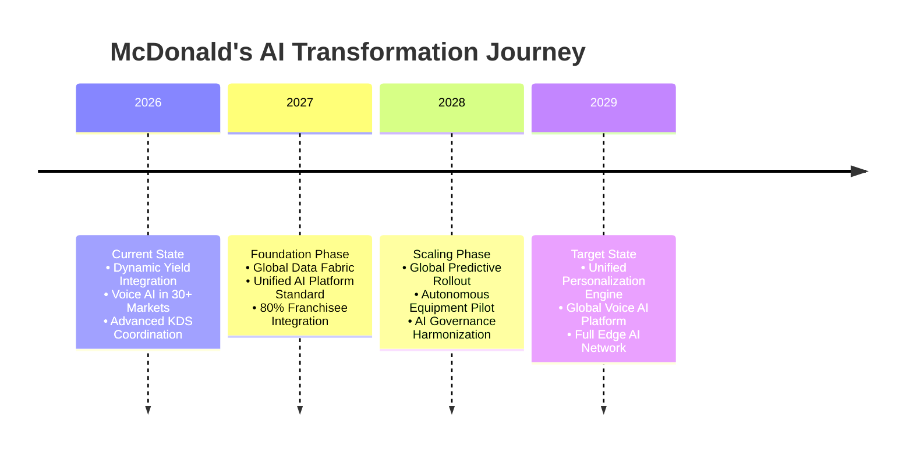
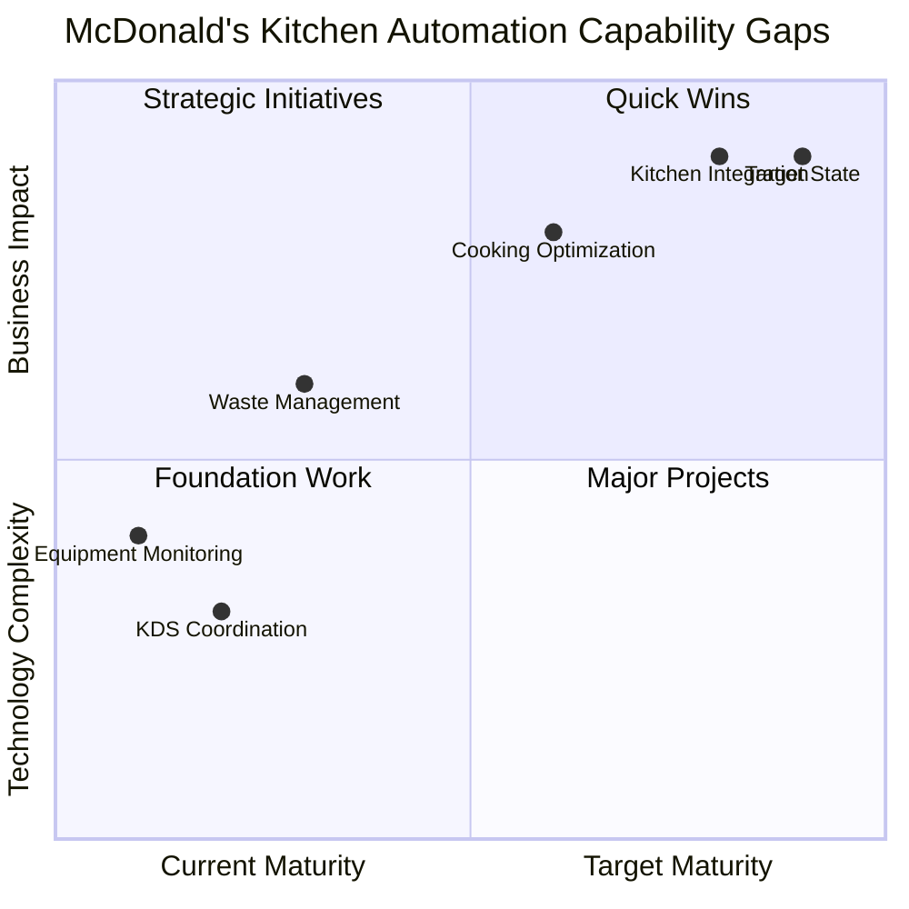

# Enterprise Architecture for McDonald's AI & Data-Driven Transformation: A Principal Architect's Strategic Blueprint

## Executive Summary

##### McDonald's stands at a critical inflection point in its digital transformation journey. 

#### As a global restaurant chain serving 69 million customers daily across 40,000+ locations, the company's transition from fast food to tech-guided-fast-food services requires a deliberate enterprise architecture approach. 

#### This comprehensive guide outlines how strategic business capability modeling enables McDonald's to systematically align its AI/ML ambitions—from hyper-personalization to automated kitchens—with executable technology roadmaps, ensuring measurable business outcomes and sustained competitive advantage in the Quick Service Restaurant (QSR) industry.

---

## 1. The Strategic Imperative: Business Capability Modeling for McDonald's AI Revolution

### 1.1 McDonald's-Specific Capability Challenges

##### Based on McDonald's technical blog and public disclosures, the organization faces unique capability challenges:

- Global-Local Tension: Balancing centralized AI platforms with franchisee autonomy

- Real-time Complexity: Processing millions of transactions hourly across disparate systems

- Edge Computing Demands: Kitchen automation and drive-thru AI requiring low-latency processing

- Data Silos: Historical separation between POS, supply chain, mobile app, and kitchen systems

- Regulatory Diversity: 100+ countries with varying data privacy and AI regulations


```python

               CURRENT STATE (2026)                             TARGET STATE (2029)
┌────────────────────────────────────────────┐     ┌────────────────────────────────────────────┐
│    CURRENT CAPABILITIES                    │     │    TARGET CAPABILITIES                     │
│    • Silos: POS ≠ Mobile ≠ Supply Chain    │     │    • Unified Customer 360° View            │
│    • Basic Personalization (Dynamic Yield) │     │    • Predictive Kitchen Operations         │
│    • Limited Edge AI (Pilot Programs)      │     │    • Full Edge AI Deployment               │
│    • Manual Operations Dominant            │     │    • Autonomous Restaurant Elements        │
│    • Fragmented Data Governance            │     │    • Integrated Data/AI Governance         │
└────────────────────────────────────────────┘     └────────────────────────────────────────────┘
                        ▲                                        ▲
                        │                                        │
                        └────────── TRANSFORMATION ──────────────┘
                                 ARCHITECTURE ROADMAP
```


### *Figure 1: McDonald's current and target AI/Data capability landscape*


# 🍟 MCDONALD'S AI CAPABILITY ECOSYSTEM 2026 → 2029



# 🍟 MCDONALD'S AI CAPABILITY ECOSYSTEM 2026 → 2029




# 🍟 MCDONALD'S AI CAPABILITY ECOSYSTEM 2026 → 2029

## 📅 Transformation Timeline

| Year | Phase | Key Initiatives | Expected Outcomes |
|------|-------|-----------------|-------------------|
| **2026** | **Current State** | • Dynamic Yield fully integrated<br>• Voice AI expanded to 30+ markets<br>• Production IoT sensors deployed<br>• Regional edge computing established | Foundation for global AI expansion |
| **2027** | **Foundation** | • Global data fabric implementation<br>• Unified AI platform standardization<br>• 80% franchisee system integration | Single source of truth, standardized platforms |
| **2028** | **Scale** | • Global predictive AI rollout<br>• Autonomous equipment pilots<br>• AI governance framework harmonization | AI-driven operations at scale |
| **2029** | **Target State** | • Unified personalization engine<br>• Full edge AI network deployment<br>• AI-first restaurant operations | Fully integrated, autonomous AI ecosystem |

##  Target State (2029) Capabilities
- **Unified Personalization Engine:** Real-time customer preference prediction
- **Global Voice AI Platform:** Consistent multilingual customer experience
- **Predictive Kitchen AI:** Proactive inventory and preparation optimization
- **Autonomous Equipment Fleet:** Self-optimizing kitchen equipment
- **Integrated AI Governance:** Global compliance and ethics framework
- **Full Edge AI Network:** Real-time processing in every restaurant
- **AI-First Restaurant Ops:** Complete AI-driven operations lifecycle


## 2. Integrating Business Capability Models with McDonald's Architecture

##### For McDonald's global scale and franchise-based operational model, traditional enterprise architecture frameworks require significant adaptation. The integration of business capability models with McDonald's architecture must address the unique tension between centralized efficiency and local autonomy, while enabling scalable AI deployment across 40,000+ diverse locations.

### 2.1 McDonald's-Specific TOGAF ADM Adaptation

##### McDonald's requires a modified TOGAF Architecture Development Method (ADM) that incorporates franchisee engagement cycles and market-specific compliance checkpoints. This adaptation transforms the standard ADM into a federated architecture approach, where global AI platforms support local customization while maintaining core governance standards across all markets.


```python
┌─────────────────────────────────────────────────────────────────────────────┐
│                       🍟  TOGAF ADM for McDonald's AI                       │
├─────────────────────────────────────────────────────────────────────────────┤
│                                                                             │
│  ┌─────────────────┐    ┌─────────────────┐    ┌─────────────────┐          │
│  │  Preliminary:   │    │   Phase A:      │    │  Phase B:       │          │
│  │  Digital Vision │────▶│  Architecture │────▶│  Business      │          │
│  │  & Strategy     │    │  Vision         │    │  Architecture   │          │
│  │                 │    │  QSR AI         │    │  Restaurant Ops │          │
│  │                 │    │  Business Case  │    │  Capabilities   │          │
│  └─────────────────┘    └─────────────────┘    └─────────────────┘          │
│                                                                             │
│  ┌─────────────────┐    ┌─────────────────┐    ┌─────────────────┐          │
│  │  Phase C:       │    │  Phase D:       │    │  Phase E:       │          │
│  │  Information    │────▶│ Technology     │────▶│ Opportunities │          │
│  │  Systems        │    │  Architecture   │    │  & Solutions    │          │
│  │  Global Data    │    │  Edge AI        │    │  Kitchen        │          │
│  │  Lake           │    │  Platform       │    │  Automation     │          │
│  └─────────────────┘    └─────────────────┘    └─────────────────┘          │
│                                                                             │
│  ┌─────────────────┐    ┌─────────────────┐    ┌─────────────────┐          │
│  │  Phase F:       │    │  Phase G:       │    │  Phase H:       │          │
│  │  Migration      │────▶│  Implementation │────▶│  Architecture  │────────┘
│  │  Planning       │    │  Model          │    │  Change         │          │
│  │  Franchisee     │    │  Deployment to  │    │  Continuous     │          │
│  │  Rollout        │    │  40K Locations  │    │  Menu Optimiz.  │          │
│  └─────────────────┘    └─────────────────┘    └─────────────────┘          │
│                                                                             │
└─────────────────────────────────────────────────────────────────────────────┘

```

*Figure 2: McDonald's-specific TOGAF cycle for global AI deployment*

---

### 2.2 ArchiMate EA Model for McDonald's Restaurant Technology Stack & Roadmap

```python
┌─────────────────────────────────────────────────────────────────────────────┐
│                  ARCHIMATE EA MODEL: McDonald's Restaurant Tech Stack       │
├─────────────────────────────────────────────────────────────────────────────┤
│                                                                             │
│  ┌──────────────────────────────────────────────────────────────────────┐   │
│  │                        BUSINESS LAYER                                │   │
│  │  ┌──────────────────────────────────────────────────────────────┐    │   │
│  │  │  Business Capabilities & Value Streams                       │    │   │
│  │  │  • Hyper-Personalized Customer Experience                    │    │   │
│  │  │  • Optimized Kitchen Throughput & Efficiency                 │    │   │
│  │  │  • Predictive Supply Chain Management                        │    │   │
│  │  │  • Automated Restaurant Operations                           │    │   │
│  │  │  • Franchisee Business Intelligence                          │    │   │
│  │  └──────────────────────────────────────────────────────────────┘    │   │
│  └──────────────────────────────────────────────────────────────────────┘   │
│                                    ▲ realizes                               │
│                                    │                                        │
│  ┌──────────────────────────────────────────────────────────────────────┐   │
│  │                      APPLICATION LAYER                               │   │
│  │  ┌──────────────────────────────────────────────────────────────┐    │   │
│  │  │  Application Components & Services                           │    │   │
│  │  │  • Dynamic Menu Engine & Pricing System                      │    │   │
│  │  │  • AI Drive-Thru Assistant (Voice/NLP)                       │    │   │
│  │  │  • Smart Kitchen Orchestrator & KDS                          │    │   │
│  │  │  • Predictive Maintenance System                             │    │   │
│  │  │  • Franchisee Performance Dashboard                          │    │   │
│  │  │  • Global Mobile App & Loyalty Platform                      │    │   │
│  │  └──────────────────────────────────────────────────────────────┘    │   │
│  └──────────────────────────────────────────────────────────────────────┘   │
│                          ▲ deployed on        ▲ uses                        │
│                          │                    │                             │
│  ┌──────────────────────────────────────────────────────────────────────┐   │
│  │                      TECHNOLOGY LAYER                                │   │
│  │  ┌──────────────────────────────────────────────────────────────┐    │   │
│  │  │  Technology Services & Infrastructure                        │    │   │
│  │  │  • Global Feature Store (Customer Preferences)               │    │   │
│  │  │  • Edge AI Inference (NVIDIA GPUs at Restaurants)            │    │   │
│  │  │  • Real-time Data Pipeline (Apache Kafka)                    │    │   │
│  │  │  • Model Registry & MLflow                                   │    │   │
│  │  │  • IoT Gateway & Edge Computing                              │    │   │
│  │  │  • API Gateway & Microservices                               │    │   │
│  │  └──────────────────────────────────────────────────────────────┘    │   │
│  └──────────────────────────────────────────────────────────────────────┘   │
│                                    ▲ hosted on                              │
│                                    │                                        │
│  ┌──────────────────────────────────────────────────────────────────────┐   │
│  │                        PHYSICAL LAYER                                │   │
│  │  ┌──────────────────────────────────────────────────────────────┐    │   │
│  │  │  Physical Infrastructure & Devices                           │    │   │
│  │  │  • Restaurant POS Systems (NCR, Square, etc.)                │    │   │
│  │  │  • Kitchen Automation Hardware & Robotics                    │    │   │
│  │  │  • Drive-Thru Sensors, Cameras & Audio                       │    │   │
│  │  │  • Cloud Regions (GCP/AWS per market compliance)             │    │   │
│  │  │  • Edge Computing Devices (Restaurant Servers)               │    │   │
│  │  └──────────────────────────────────────────────────────────────┘    │   │
│  └──────────────────────────────────────────────────────────────────────┘   │
│                                                                             │
├─────────────────────────────────────────────────────────────────────────────┤
│  Legend: ◉ Business Process  ◉ Application Service  ◉ Technology Component│
│          ◉ Physical Device   ───▶ realizes          ───▶ deployed on      │
└────────────────────────────────────────────────────────────────────────────┘

````
Figure 3: ArchiMate layered architecture showing McDonald's technology stack from business capabilities to physical implementation*

---

### 🍟 2.3 McDonald's AI Systems: Zachman Framework Analysis

| Perspective | Data (What) | Function (How) | Network (Where) | People (Who) | Time (When) | Motivation (Why) |
|-------------|-------------|----------------|-----------------|--------------|-------------|------------------|
| **Scope**<br>*(Executive View)* | • Customer purchase history<br>• Seasonal preference data<br>• Regional menu variations | • Global personalization engine<br>• Cross-market recommendation system | • 40,000+ global restaurants<br>• Mobile app (70M+ users)<br>• Drive-thru systems | • 2M+ crew members<br>• Corporate leadership<br>• Global customers | • Real-time recommendations<br>• 24/7 operations | • $25B digital sales target<br>• 30% digital revenue growth<br>• Enhanced customer experience |
| **Business**<br>*(Owner View)* | • Menu engineering data<br>• Price elasticity models<br>• Regional demand patterns | • Dynamic pricing algorithms<br>• Inventory prediction<br>• Kitchen load balancing | • Regional market clusters<br>• Supply chain networks<br>• Franchisee ecosystems | • Franchise owners (2,000+)<br>• Regional managers<br>• Marketing teams | • Peak hour optimization<br>• Seasonal campaign timing<br>• Supply chain cycles | • 5% sales lift via personalization<br>• 15% waste reduction<br>• 20% faster service times |
| **System**<br>*(Designer View)* | • Feature vectors (200+ features)<br>• Training datasets (PB-scale)<br>• Real-time streaming data | • Neural recommendation engine<br>• Real-time prediction service<br>• A/B testing framework | • Edge-cloud hybrid architecture<br>• Multi-region AWS deployment<br>• CDN for global latency | • Data scientists (100+)<br>• AI researchers<br>• Product managers | • <100ms inference latency<br>• Daily model updates<br>• Real-time feedback loops | • 99.9% system availability<br>• Scalable to 10K QPS<br>• <1% error rate |
| **Technology**<br>*(Builder View)* | • TensorFlow SavedModels<br>• PyTorch checkpoints<br>• ONNX format models | • TensorFlow Serving<br>• NVIDIA Triton inference<br>• Redis caching layer | • AWS SageMaker endpoints<br>• NVIDIA Jetson edge devices<br>• 5G mobile networks | • ML engineers<br>• MLOps specialists<br>• Cloud architects | • Weekly model retraining<br>• Continuous deployment<br>• Rolling updates | • $0.001 per inference cost<br>• 95% GPU utilization<br>• 50% energy efficiency |
| **Detailed**<br>*(Implementer View)* | • Quantized INT8 models<br>• Pruned network weights<br>• Model binaries | • CUDA kernel optimization<br>• TensorRT acceleration<br>• Memory optimization | • Restaurant WiFi 6 networks<br>• Local GPU servers<br>• Edge compute nodes | • DevOps engineers<br>• System administrators<br>• Field technicians | • Microsecond inference<br>• Sub-millisecond I/O<br>• Nanosecond tensor ops | • Hardware thermal limits<br>• Power consumption constraints<br>• Physical space limitations |

---

## 3. McDonald's Four-Phase Business Capability Modeling

> [!IMPORTANT]
> The analysis presented below draws from our thorough review of publicly available online sources, including the McDonald's Global Tech blog (available at: https://medium.com/mcdonalds-technical-blog). While we have strived for accuracy, we recognize that some of the information referenced  may have evolved since our research was conducted.
>


### <ins>Phase 1</ins>: Strategic Assessment of McDonald's AI Opportunities

#### McDonald's-Specific Activities:

- Franchisee council workshops on AI adoption barriers

- Competitive analysis against Starbucks' Deep Brew and Domino's AI initiatives

- Assessment of current tech stack fragmentation (POS vendors, mobile platforms)

- Regulatory mapping for 100+ countries on customer data usage

- AI ambition levels for McDonald's:

  - Current: Basic personalization (Dynamic Yield)

  - 2026: Predictive kitchen operations

  - 2027-2029: Autonomous restaurant elements
 


 *Figure 4: McDonald's-specific AI capability assessment & Gap Analysis*


 ---

### <ins>Phase 2</ins>: Target Capability Architecture for McDonald's

#### McDonald's-Specific Capabilities:

- Real-time Menu Optimization: Dynamic pricing and item suggestions based on inventory, weather, local events

- Predictive Kitchen Load Balancing: AI forecasting of order volumes for preparation optimization

- Unified Customer Identity: 360° view across app, kiosk, drive-thru, and delivery

- Autonomous Food Safety Monitoring: Computer vision for quality control

- Franchisee Performance Intelligence: Predictive analytics for local store marketing

---

### 🍟 McDonald's Kitchen Automation Capability & GAP Analysis

### <ins>Current vs Target State Comparison</kns>
| | Current State | Target State | Gap |
|-|---------------|--------------|-----|
| **Maturity Score** | ⭐⭐🟊🟊🟊 (2.2/5.0) | ⭐⭐⭐⭐🟊 (4.5/5.0) | **2.3 points** |

### 🟥 <ins>Current State</ins> (2026) - Maturity: 2.2/5.0
**Operational Characteristics:**
- **KDS Coordination:** Basic digital kitchen display system
- **Equipment Monitoring:** Manual checks, reactive maintenance
- **Waste Management:** End-of-day reconciliation, reactive
- **Cooking Processes:** Fixed timers, standardized recipes
- **System Integration:** Silos between ordering, inventory, kitchen

### 🟩 <ins>Target State</ins> (2029) - Maturity: 4.5/5.0
**Advanced Capabilities:**
- **AI-Optimized Scheduling:** Dynamic prep based on real-time demand
- **Predictive Maintenance:** AI alerts before equipment failure
- **Proactive Waste Reduction:** ML-driven inventory optimization
- **Dynamic Cooking:** Adaptive parameters for quality and speed
- **Integrated Intelligence:** Unified kitchen operating system


###  <ins>Identified Capability Gaps</ins>

### 1. Real-time Ingredient Tracking Sensors
- **Gap:** Lack of IoT sensors for ingredient usage monitoring
- **Impact:** Inaccurate inventory, food waste
- **Solution:** RFID/NFC sensors + weight measurement systems

### 2. Computer Vision for Food Quality
- **Gap:** Manual visual inspection of food quality
- **Impact:** Inconsistent quality, customer dissatisfaction
- **Solution:** AI cameras for color, texture, doneness analysis

### 3. ML Models for Demand Forecasting
- **Gap:** Basic historical averaging for demand prediction
- **Impact:** Over/under preparation, waste or stockouts
- **Solution:** Time-series ML models with external factors

### 4. IoT Integration Platform
- **Gap:** Disconnected IoT devices without unified management
- **Impact:** Manual data collection, inconsistent insights
- **Solution:** Centralized IoT platform with real-time analytics

### 5. Edge AI Infrastructure
- **Gap:** Limited computing at restaurant level
- **Impact:** Cloud dependency, latency in real-time decisions
- **Solution:** Edge computing nodes with GPU acceleration


### 💰 <ins>Investment & ROI Analysis</ins>

### <ins>Financial Summary</ins>
| Metric | Value | Calculation |
|--------|-------|-------------|
| **Per Restaurant Cost** | $3,200 | Total investment ÷ 1,000 |
| **Total Investment** | $3.2M | For 1,000 restaurants |
| **Annual Food Cost Savings** | 15% | AI optimization + waste reduction |
| **Throughput Increase** | 20% | Optimized kitchen workflows |
| **Annual Value per Restaurant** | $48,000 | Based on $320K average food cost |
| **Total Annual Savings** | $48M | 1,000 restaurants × $48,000 |
| **Payback Period** | 2.4 months | Investment ÷ Monthly savings |
| **3-Year ROI** | 4,400% | (3-year savings - investment) ÷ investment |

### <ins>Investment & ROI Summary</ins>
- **Investment Required:** $3.2M per 1,000 restaurants
- **Expected ROI (3 Years):**
  - **15% reduction** in food costs
  - **20% increase** in kitchen throughput
  - **30% reduction** in food waste
  - **25% improvement** in order accuracy

### <ins>Implementation Timeline</ins>
- **Phase 1 (6 months):** IoT sensors + integration platform
- **Phase 2 (6 months):** Computer vision + edge infrastructure
- **Phase 3 (12 months):** ML models + full integration
- **Phase 4 (12 months):** Optimization + scaling

---

### <ins>Phase 3</ins>: Current State Assessment & Gap Analysis

#### McDonald's Current Tech Stack Analysis (from technical blog):

- Strengths: Global mobile app penetration, Dynamic Yield acquisition, Cloud migration underway

- Weaknesses: Fragmented POS systems, Limited real-time data integration, Siloed data teams

- Opportunities: Kitchen automation patents, Voice AI acquisitions, Edge computing partnerships

- Threats: Regional data sovereignty laws, Franchisee adoption resistance, Competitive AI investments
  
---

### <ins>Phase 4</ins>: McDonald's-Specific Roadmap

#### Prioritization Framework for McDonald's:

- Quick Wins (0-6 months): Enhanced personalization using existing Dynamic Yield

- Foundation (6-18 months): Global data platform unification

- Differentiation (18-36 months): Kitchen AI and automation

- Transformation (36-60 months): Autonomous restaurant capabilities

---

## 4. Quantifying Impact: EA-Guided vs Current McDonald's AI Approach

### 4.1 Comparative Analysis: McDonald's Current vs EA vs Industry's Best


  *Figure 5: EA-guided approach impact analysis for McDonald's*
  
---

### 4.2 Financial Impact Analysis for Data/AI/EA Adoption

#### Three-Year ROI Projection (40,000 restaurants):

| Investment Area | EA-Guided Approach | Current Trajectory | Delta | Rationale |
|-----------------|--------------------|--------------------|-------|-----------|
| Personalization ROI | $1.2B annual sales lift | $0.6B annual sales lift | +$0.6B | Unified customer view vs fragmented data |
| Kitchen Efficiency | 15% food cost reduction | 5% reduction | +$0.9B | AI-optimized inventory vs basic systems |
| Labor Optimization | 10% labor cost reduction | 2% reduction | +$0.4B | Predictive scheduling vs static schedules |
| Implementation Cost | $2.1B total investment | $1.8B investment | -$0.3B | Strategic platform vs point solutions |
| Technical Debt | $0.2B annual maintenance | $0.5B annual maintenance | +$0.3B | Standardized architecture vs siloed systems |
| 3-Year Net Value | +$3.1B | +$0.9B | +$2.2B | EA advantage |


