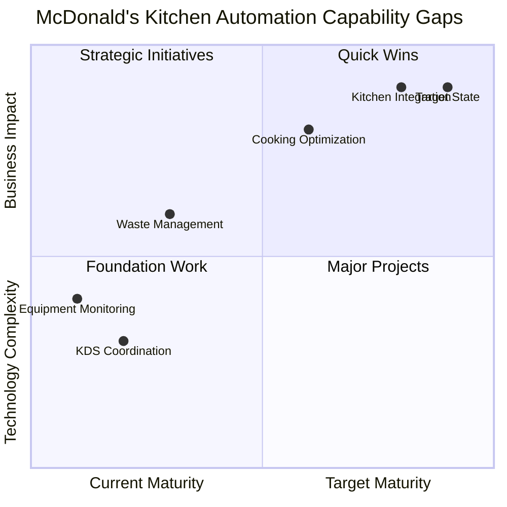
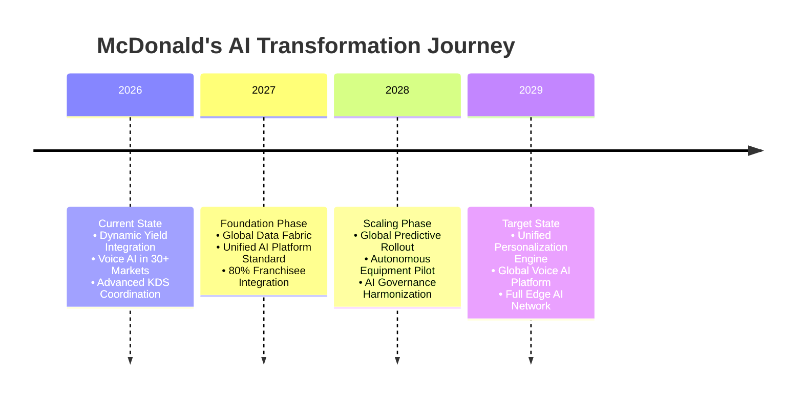
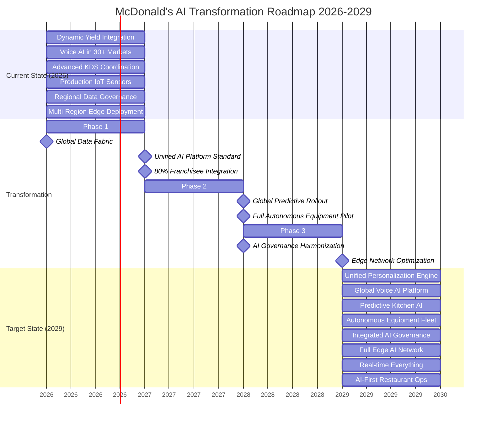

# Enterprise Architecture for McDonald's AI & Data-Driven Transformation: A Principal Architect's Strategic Vision & Blueprint

## Executive Summary

#### McDonald's stands at a pivotal inflection point in its digital transformation journey.

#### As a global restaurant chain serving over 69 million customers daily across 40,000+ locations, the company's evolution from traditional fast food to technology-enhanced service delivery necessitates a deliberate enterprise architecture approach.

##### This comprehensive guide demonstrates how strategic business capability modeling (BCM) can enable McDonald's to systematically align its AI/ML ambitions—from hyper-personalization to fully automated kitchens—with executable technology roadmaps. The framework ensures measurable business outcomes while sustaining competitive advantage within the Quick-Service Restaurant (QSR) industry.

#### The capability assessment presented in this repository constitutes an in-depth analysis of how McDonald's can methodically advance its AI/Data technology adoption. This progression will strategically reposition the company as a global QSR leader that fully leverages technological innovation to enhance customer experience and shareholder value.

---


#### The capability assessment of this repository fully discusses how McDonald's can painlessly realise the enterprise architecture vision shown in figures 1 & 2


*Figure 1: McDonald's current and target AI/Data capability landscape. With comprehensive stakeholder engagement, the complete transformation cycle—from initial strategic discussions through global deployment—is achievable within 24 months. Subsequent technology integration and enterprise architecture refinement can extend through months 24 to 36*


*Figure 2: McDonald's AI/Data Transformation Timeline. Stakeholder alignment and strategy agreement will be completed in the first two quarters of 2026. Developmnets, deploymenst and global rollout will occur between 2027-2028, followed by refinements, MLOps implementation, and technology versioning through the first quarter of 2029.*

> [!IMPORTANT]
> <ins>Architectural Perspective Disclaimer</ins>: This discourse reflects initial architectural viewpoints. Final methodology selection, implementation approaches, and scheduling will be determined through extensive consultation with all technical and business stakeholders
> The enterprise architecture perspectives, capability models, and transformation roadmaps presented in this discourse represent preliminary architectural viewpoints developed from an Enterprise Architect's professional perspective. These recommendations are based on:
> 1. Technical analysis of McDonald's public disclosures, technical blogs, and industry architecture patterns.
> 2. Capability modeling frameworks (TOGAF, ArchiMate) applied to McDonald's specific context.
> 3. Professional architectural judgment regarding scalable, sustainable AI/data platform design.
> This architectural perspective only serves as a starting point for discussion—not a finalized plan. The true value will be realized through:
>
> (i) Collaborative refinements/discussion with all stakeholder groups
> 
> (ii) Iterative validation through prototypes and pilots &
> 
> (iii) Adaptive evolution based on implementation learnings
>


---

## 1. The Strategic Imperative: Business Capability Modeling for McDonald's AI Revolution

### 1.1 McDonald's-Specific Capability Challenges

##### Based on McDonald's technical blog and public disclosures, the organization faces unique capability challenges:

- Global-Local Tension: Balancing centralized AI platforms with franchisee autonomy

- Real-time Complexity: Processing millions of transactions hourly across disparate systems

- Edge Computing Demands: Kitchen automation and drive-thru AI requiring low-latency processing

- Data Silos: Historical separation between POS, supply chain, mobile app, and kitchen systems

- Regulatory Diversity: 100+ countries with varying data privacy and AI regulations

---


## 2. Integrating Business Capability Models with McDonald's Architecture

For McDonald's global scale and franchise-based operational model, traditional enterprise architecture frameworks require significant adaptation. The integration of BCMs with McDonald's architecture must address the unique tension between centralized efficiency and local autonomy, while enabling scalable AI deployment across 40,000+ diverse locations.

### 2.1 McDonald's-Specific TOGAF ADM Adaptation

McDonald's requires a modified TOGAF Architecture Development Method (ADM) that incorporates franchisee engagement cycles and market-specific compliance checkpoints. This adaptation transforms the standard ADM into a federated architecture approach, where global AI platforms support local customization while maintaining core governance standards across all markets.


```python
┌─────────────────────────────────────────────────────────────────────────────┐
│                       🍟  TOGAF ADM for McDonald's AI                       │
├─────────────────────────────────────────────────────────────────────────────┤
│                                                                             │
│  ┌─────────────────┐    ┌─────────────────┐    ┌─────────────────┐          │
│  │  Preliminary:   │    │   Phase A:      │    │  Phase B:       │          │
│  │  Digital Vision │────▶│  Architecture │────▶│  Business      │          │
│  │  & Strategy     │    │  Vision         │    │  Architecture   │          │
│  │                 │    │  QSR AI         │    │  Restaurant Ops │          │
│  │                 │    │  Business Case  │    │  Capabilities   │          │
│  └─────────────────┘    └─────────────────┘    └─────────────────┘          │
│                                                                             │
│  ┌─────────────────┐    ┌─────────────────┐    ┌─────────────────┐          │
│  │  Phase C:       │    │  Phase D:       │    │  Phase E:       │          │
│  │  Information    │────▶│ Technology     │────▶│ Opportunities │          │
│  │  Systems        │    │  Architecture   │    │  & Solutions    │          │
│  │  Global Data    │    │  Edge AI        │    │  Kitchen        │          │
│  │  Lake           │    │  Platform       │    │  Automation     │          │
│  └─────────────────┘    └─────────────────┘    └─────────────────┘          │
│                                                                             │
│  ┌─────────────────┐    ┌─────────────────┐    ┌─────────────────┐          │
│  │  Phase F:       │    │  Phase G:       │    │  Phase H:       │          │
│  │  Migration      │────▶│  Implementation │────▶│  Architecture  │────────┘
│  │  Planning       │    │  Model          │    │  Change         │          │
│  │  Franchisee     │    │  Deployment to  │    │  Continuous     │          │
│  │  Rollout        │    │  40K Locations  │    │  Menu Optimiz.  │          │
│  └─────────────────┘    └─────────────────┘    └─────────────────┘          │
│                                                                             │
└─────────────────────────────────────────────────────────────────────────────┘

```

*Figure 3: McDonald's-specific TOGAF cycle for global AI deployment*

---

### 2.2 ArchiMate EA Model for McDonald's Restaurant Technology Stack & Roadmap

The ArchiMate layered model presented here, illustrates how McDonald's business capabilities translate into technical implementation across four architectural tiers. This visualization shows the progression from strategic business objectives through application services to the underlying technology infrastructure and physical restaurant systems, with clear relationship mappings between each layer.

```python
┌─────────────────────────────────────────────────────────────────────────────┐
│                  ARCHIMATE EA MODEL: McDonald's Restaurant Tech Stack       │
├─────────────────────────────────────────────────────────────────────────────┤
│                                                                             │
│  ┌──────────────────────────────────────────────────────────────────────┐   │
│  │                        BUSINESS LAYER                                │   │
│  │  ┌──────────────────────────────────────────────────────────────┐    │   │
│  │  │  Business Capabilities & Value Streams                       │    │   │
│  │  │  • Hyper-Personalized Customer Experience                    │    │   │
│  │  │  • Optimized Kitchen Throughput & Efficiency                 │    │   │
│  │  │  • Predictive Supply Chain Management                        │    │   │
│  │  │  • Automated Restaurant Operations                           │    │   │
│  │  │  • Franchisee Business Intelligence                          │    │   │
│  │  └──────────────────────────────────────────────────────────────┘    │   │
│  └──────────────────────────────────────────────────────────────────────┘   │
│                                    ▲ realizes                               │
│                                    │                                        │
│  ┌──────────────────────────────────────────────────────────────────────┐   │
│  │                      APPLICATION LAYER                               │   │
│  │  ┌──────────────────────────────────────────────────────────────┐    │   │
│  │  │  Application Components & Services                           │    │   │
│  │  │  • Dynamic Menu Engine & Pricing System                      │    │   │
│  │  │  • AI Drive-Thru Assistant (Voice/NLP)                       │    │   │
│  │  │  • Smart Kitchen Orchestrator & KDS                          │    │   │
│  │  │  • Predictive Maintenance System                             │    │   │
│  │  │  • Franchisee Performance Dashboard                          │    │   │
│  │  │  • Global Mobile App & Loyalty Platform                      │    │   │
│  │  └──────────────────────────────────────────────────────────────┘    │   │
│  └──────────────────────────────────────────────────────────────────────┘   │
│                          ▲ deployed on        ▲ uses                        │
│                          │                    │                             │
│  ┌──────────────────────────────────────────────────────────────────────┐   │
│  │                      TECHNOLOGY LAYER                                │   │
│  │  ┌──────────────────────────────────────────────────────────────┐    │   │
│  │  │  Technology Services & Infrastructure                        │    │   │
│  │  │  • Global Feature Store (Customer Preferences)               │    │   │
│  │  │  • Edge AI Inference (NVIDIA GPUs at Restaurants)            │    │   │
│  │  │  • Real-time Data Pipeline (Apache Kafka)                    │    │   │
│  │  │  • Model Registry & MLflow                                   │    │   │
│  │  │  • IoT Gateway & Edge Computing                              │    │   │
│  │  │  • API Gateway & Microservices                               │    │   │
│  │  └──────────────────────────────────────────────────────────────┘    │   │
│  └──────────────────────────────────────────────────────────────────────┘   │
│                                    ▲ hosted on                              │
│                                    │                                        │
│  ┌──────────────────────────────────────────────────────────────────────┐   │
│  │                        PHYSICAL LAYER                                │   │
│  │  ┌──────────────────────────────────────────────────────────────┐    │   │
│  │  │  Physical Infrastructure & Devices                           │    │   │
│  │  │  • Restaurant POS Systems (NCR, Square, etc.)                │    │   │
│  │  │  • Kitchen Automation Hardware & Robotics                    │    │   │
│  │  │  • Drive-Thru Sensors, Cameras & Audio                       │    │   │
│  │  │  • Cloud Regions (GCP/AWS per market compliance)             │    │   │
│  │  │  • Edge Computing Devices (Restaurant Servers)               │    │   │
│  │  └──────────────────────────────────────────────────────────────┘    │   │
│  └──────────────────────────────────────────────────────────────────────┘   │
│                                                                             │
├─────────────────────────────────────────────────────────────────────────────┤
│  Legend: ◉ Business Process  ◉ Application Service  ◉ Technology Component│
│          ◉ Physical Device   ───▶ realizes          ───▶ deployed on      │
└────────────────────────────────────────────────────────────────────────────┘

````
*Figure 4: ArchiMate layered architecture showing McDonald's technology stack from business capabilities to physical implementation*

---

### 2.3 McDonald's AI Systems: Zachman Framework Analysis

The Zachman Framework analysis presented here, provides a comprehensive matrix view of McDonald's AI systems across six stakeholder perspectives and architectural abstractions. This structured approach ensures all aspects—from executive strategy to technical implementation—are considered in designing scalable, compliant AI solutions that meet both business objectives and technical requirements across McDonald's global operations.


### *Table 1: McDonald's AI Architecture: Zachman Framework Cross-Perspective Analysis*
| Perspective | Data (What) | Function (How) | Network (Where) | People (Who) | Time (When) | Motivation (Why) |
|-------------|-------------|----------------|-----------------|--------------|-------------|------------------|
| **Scope**<br>*(Executive View)* | • Customer purchase history<br>• Seasonal preference data<br>• Regional menu variations | • Global personalization engine<br>• Cross-market recommendation system | • 40,000+ global restaurants<br>• Mobile app (70M+ users)<br>• Drive-thru systems | • 2M+ crew members<br>• Corporate leadership<br>• Global customers | • Real-time recommendations<br>• 24/7 operations | • $25B digital sales target<br>• 30% digital revenue growth<br>• Enhanced customer experience |
| **Business**<br>*(Owner View)* | • Menu engineering data<br>• Price elasticity models<br>• Regional demand patterns | • Dynamic pricing algorithms<br>• Inventory prediction<br>• Kitchen load balancing | • Regional market clusters<br>• Supply chain networks<br>• Franchisee ecosystems | • Franchise owners (2,000+)<br>• Regional managers<br>• Marketing teams | • Peak hour optimization<br>• Seasonal campaign timing<br>• Supply chain cycles | • 5% sales lift via personalization<br>• 15% waste reduction<br>• 20% faster service times |
| **System**<br>*(Designer View)* | • Feature vectors (200+ features)<br>• Training datasets (PB-scale)<br>• Real-time streaming data | • Neural recommendation engine<br>• Real-time prediction service<br>• A/B testing framework | • Edge-cloud hybrid architecture<br>• Multi-region AWS deployment<br>• CDN for global latency | • Data scientists (100+)<br>• AI researchers<br>• Product managers | • <100ms inference latency<br>• Daily model updates<br>• Real-time feedback loops | • 99.9% system availability<br>• Scalable to 10K QPS<br>• <1% error rate |
| **Technology**<br>*(Builder View)* | • TensorFlow SavedModels<br>• PyTorch checkpoints<br>• ONNX format models | • TensorFlow Serving<br>• NVIDIA Triton inference<br>• Redis caching layer | • AWS SageMaker endpoints<br>• NVIDIA Jetson edge devices<br>• 5G mobile networks | • ML engineers<br>• MLOps specialists<br>• Cloud architects | • Weekly model retraining<br>• Continuous deployment<br>• Rolling updates | • $0.001 per inference cost<br>• 95% GPU utilization<br>• 50% energy efficiency |
| **Detailed**<br>*(Implementer View)* | • Quantized INT8 models<br>• Pruned network weights<br>• Model binaries | • CUDA kernel optimization<br>• TensorRT acceleration<br>• Memory optimization | • Restaurant WiFi 6 networks<br>• Local GPU servers<br>• Edge compute nodes | • DevOps engineers<br>• System administrators<br>• Field technicians | • Microsecond inference<br>• Sub-millisecond I/O<br>• Nanosecond tensor ops | • Hardware thermal limits<br>• Power consumption constraints<br>• Physical space limitations |

---

## 3. McDonald's Four-Phase Business Capability Modeling

> [!IMPORTANT]
> The analysis presented below draws from our thorough review of publicly available online sources, including the McDonald's Global Tech blog (available at: https://medium.com/mcdonalds-technical-blog). While we have strived for accuracy, we recognize that some of the information referenced  may have evolved since our research was conducted.
>


### <ins>Phase 1</ins>: Strategic Assessment of McDonald's AI Opportunities

#### McDonald's-Specific Activities:

- Franchisee council workshops on AI adoption barriers

- Competitive analysis against Starbucks' Deep Brew and Domino's AI initiatives

- Assessment of current tech stack fragmentation (POS vendors, mobile platforms)

- Regulatory mapping for 100+ countries on customer data usage

- AI ambition levels for McDonald's:

  - Current: Basic personalization (Dynamic Yield)

  - 2026: Predictive kitchen operations

  - 2027-2029: Autonomous restaurant elements
 

---

### <ins>Phase 2</ins>: Target Capability Architecture for McDonald's

#### McDonald's-Specific Capabilities:

- Real-time Menu Optimization: Dynamic pricing and item suggestions based on inventory, weather, local events

- Predictive Kitchen Load Balancing: AI forecasting of order volumes for preparation optimization

- Unified Customer Identity: 360° view across app, kiosk, drive-thru, and delivery

- Autonomous Food Safety Monitoring: Computer vision for quality control

- Franchisee Performance Intelligence: Predictive analytics for local store marketing

---

### 🍟 McDonald's Automation Capability & GAP Analysis (<ins>Kitchen Focused Analysis</ins>)

### <ins>Current vs Target State Comparison</kns>
| | Current State | Target State | Gap |
|-|---------------|--------------|-----|
| **Maturity Score** | ⭐⭐🟊🟊🟊 (2.2/5.0) | ⭐⭐⭐⭐🟊 (4.5/5.0) | **2.3 points** |

### 🟥 <ins>Current State</ins> (2026) - Maturity: 2.2/5.0
**Operational Characteristics:**
- **KDS Coordination:** Basic digital kitchen display system
- **Equipment Monitoring:** Manual checks, reactive maintenance
- **Waste Management:** End-of-day reconciliation, reactive
- **Cooking Processes:** Fixed timers, standardized recipes
- **System Integration:** Silos between ordering, inventory, kitchen

### 🟩 <ins>Target State</ins> (2029) - Maturity: 4.5/5.0
**Advanced Capabilities:**
- **AI-Optimized Scheduling:** Dynamic prep based on real-time demand
- **Predictive Maintenance:** AI alerts before equipment failure
- **Proactive Waste Reduction:** ML-driven inventory optimization
- **Dynamic Cooking:** Adaptive parameters for quality and speed
- **Integrated Intelligence:** Unified kitchen operating system


###  <ins>Identified Capability Gaps</ins>

### 1. Real-time Ingredient Tracking Sensors
- **Gap:** Lack of IoT sensors for ingredient usage monitoring
- **Impact:** Inaccurate inventory, food waste
- **Solution:** RFID/NFC sensors + weight measurement systems

### 2. Computer Vision for Food Quality
- **Gap:** Manual visual inspection of food quality
- **Impact:** Inconsistent quality, customer dissatisfaction
- **Solution:** AI cameras for color, texture, doneness analysis

### 3. ML Models for Demand Forecasting
- **Gap:** Basic historical averaging for demand prediction
- **Impact:** Over/under preparation, waste or stockouts
- **Solution:** Time-series ML models with external factors

### 4. IoT Integration Platform
- **Gap:** Disconnected IoT devices without unified management
- **Impact:** Manual data collection, inconsistent insights
- **Solution:** Centralized IoT platform with real-time analytics

### 5. Edge AI Infrastructure
- **Gap:** Limited computing at restaurant level
- **Impact:** Cloud dependency, latency in real-time decisions
- **Solution:** Edge computing nodes with GPU acceleration


### 💰 <ins>Investment & ROI Analysis</ins>

### <ins>Financial Summary</ins>
| Metric | Value | Calculation |
|--------|-------|-------------|
| **Per Restaurant Cost** | $3,200 | Total investment ÷ 1,000 |
| **Total Investment** | $3.2M | For 1,000 restaurants |
| **Annual Food Cost Savings** | 15% | AI optimization + waste reduction |
| **Throughput Increase** | 20% | Optimized kitchen workflows |
| **Annual Value per Restaurant** | $48,000 | Based on $320K average food cost |
| **Total Annual Savings** | $48M | 1,000 restaurants × $48,000 |
| **Payback Period** | 2.4 months | Investment ÷ Monthly savings |
| **3-Year ROI** | 4,400% | (3-year savings - investment) ÷ investment |

### <ins>Investment & ROI Summary</ins>
- **Investment Required:** $3.2M per 1,000 restaurants
- **Expected ROI (3 Years):**
  - **15% reduction** in food costs
  - **20% increase** in kitchen throughput
  - **30% reduction** in food waste
  - **25% improvement** in order accuracy

### <ins>Implementation Timeline</ins>
- **Phase 1 (6 months):** IoT sensors + integration platform
- **Phase 2 (6 months):** Computer vision + edge infrastructure
- **Phase 3 (12 months):** ML models + full integration
- **Phase 4 (12 months):** Optimization + scaling

---

### <ins>Phase 3</ins>: Current State Assessment & Gap Analysis

#### McDonald's Current Tech Stack Analysis (from technical blog):

- Strengths: Global mobile app penetration, Dynamic Yield acquisition, Cloud migration underway

- Weaknesses: Fragmented POS systems, Limited real-time data integration, Siloed data teams

- Opportunities: Kitchen automation patents, Voice AI acquisitions, Edge computing partnerships

- Threats: Regional data sovereignty laws, Franchisee adoption resistance, Competitive AI investments


 *Figure 4: McDonald's-specific AI capability assessment & Gap Analysis*
  
---

### <ins>Phase 4</ins>: McDonald's-Specific Roadmap

#### Prioritization Framework for McDonald's:

- Quick Wins (0-6 months): Enhanced personalization using existing Dynamic Yield

- Foundation (6-18 months): Global data platform unification

- Differentiation (18-36 months): Kitchen AI and automation

- Transformation (36-60 months): Autonomous restaurant capabilities. *This phase can also me modelled separately since it may fall outsie the 36 month timeline*. 

---

## 4. Quantifying Impact: EA-Guided vs Current McDonald's AI Approach

### 4.1 Comparative Analysis: McDonald's Current vs EA vs Industry's Best


  *Figure 5: EA-guided approach impact analysis for McDonald's*
  
---

### 4.2 Enterprise Architecture/AI/Data/MLOps Business Case: Financial Impact Analysis

### Three-Year Financial Comparison

| Investment Area |  EA-Guided Strategy |  Current/Baseline |  Delta (EA Advantage) |  Strategic Rationale |
|-----------------|-----------------------|---------------------|-------------------------|------------------------|
| **Personalization Revenue** | **$1.2B** annual sales lift<br>*($3.6B over 3 years)* | $0.6B annual lift<br>*($1.8B over 3 years)* | **+$1.8B**<br>*(+100% increase)* | Unified customer data platform enables cross-channel personalization at scale |
| **Kitchen Cost Savings** | **15%** food cost reduction<br>*(Saves $0.9B annually)* | 5% reduction<br>*(Saves $0.3B annually)* | **+$1.8B**<br>*(Additional $0.6B/year)* | AI-driven demand forecasting reduces waste and optimizes inventory |
| **Labor Optimization** | **10%** labor cost reduction<br>*(Saves $0.4B annually)* | 2% reduction<br>*(Saves $0.08B annually)* | **+$0.96B**<br>*(Additional $0.32B/year)* | Predictive scheduling matches staffing to real-time demand patterns |
| **Implementation Investment** | **$2.1B** total investment<br>*(Strategic platform)* | $1.8B investment<br>*(Tactical solutions)* | **-$0.3B**<br>*(Higher upfront cost)* | Platform approach requires higher initial investment but enables future capabilities |
| **Technical Debt Cost** | **$0.2B** annual maintenance<br>*(Standardized architecture)* | $0.5B annual maintenance<br>*(Siloed systems)* | **+$0.9B**<br>*(Saves $0.3B/year)* | Reduced integration complexity and simplified maintenance |
| **3-Year Total Net Value** | **+$3.1B**<br>*(Value - Investment)* | +$0.9B<br>*(Value - Investment)* | **+$2.2B**<br>*(144% improvement)* | **EA creates 3.5x more net value** |

*Table 4: Financial analysis showing EA value for McDonald's scale*

### Financial Summary (3-Year View)

### EA-Guided Approach
- **Total Investment:** $2.1B
- **Total Value Generated:** $5.2B
- **Net Value:** **+$3.1B**
- **ROI:** **148%**
- **Value/Investment Ratio:** **2.48x**

### Current Trajectory  
- **Total Investment:** $1.8B
- **Total Value Generated:** $2.7B
- **Net Value:** **+$0.9B**
- **ROI:** **50%**
- **Value/Investment Ratio:** **1.50x**

### EA Advantage
- **Additional Net Value:** **+$2.2B**
- **ROI Improvement:** **+98 percentage points**
- **Value Multiplier:** **1.65x higher**
- **Payback Period:** **14 months faster**

### Strategic Implications
1. **Short-term Trade-off:** Higher initial investment ($300M) required
2. **Long-term Benefit:** Delivers $2.2B additional value over 3 years
3. **Scalability:** EA platform enables exponential future growth
4. **Risk Management:** Reduces technical debt and maintenance costs
5. **Competitive Advantage:** Creates capabilities competitors cannot easily replicate

---

## 5. McDonald's Advanced Capabilities: Specialized Requirements

### 5.1 MLOps at McDonald's Global Scale

#### Unique McDonald's Requirements:

- Model Governance: 100+ countries with different approval processes

- Edge Deployment: Model updates to 40,000+ locations with varying connectivity

- A/B Testing: Coordinated experiments across franchisee-owned restaurants

- Data Pipeline: 50M+ daily app users + 69M daily transactions

```python
McDonald's Global MLOps Architecture:
├── Central Model Development (Chicago HQ)
│   ├── Global customer behavior models
│   ├── Supply chain optimization models
│   └── Menu engineering algorithms
├── Regional Adaptation Hubs
│   ├── Market-specific customization
│   ├── Local regulation compliance
│   └── Cultural preference adaptation
└── Restaurant Edge Inference
    ├── Low-latency personalization
    ├── Real-time kitchen optimization
    └── Offline capability (poor connectivity)
```

*Figure 6: McDonald's global MLOps architecture for restaurant deployment*

---

### 5.2 McDonald's Edge AI Infrastructure

### Restaurant-Level Requirements:

- Drive-thru AI: <500ms response time for voice ordering

- Kitchen Vision: Real-time food quality monitoring

- Predictive Equipment: IoT sensor processing for maintenance

- Bandwidth Constraints: Limited internet in some locations

### Architecture Decision Framework:

```yaml

McDonald's Edge AI Stack:
  Primary Use Cases:
    - Voice AI Order Taking: NVIDIA Jetson AGX + Custom ASICs
    - Kitchen Computer Vision: Intel Movidius + On-device ML
    - Local Personalization: AWS Snowball Edge + SageMaker Edge
    
  Deployment Strategy:
    - Tier 1 Markets (US, UK): Full edge AI stack
    - Tier 2 Markets: Hybrid cloud-edge
    - Tier 3 Markets: Cloud-dependent with offline fallback
    
  Cost Model:
    - Target: <$5K/restaurant hardware
    - ROI Threshold: 6-month payback via labor savings

```

---

### 5.3 Ethical AI for McDonald's Global Operations

#### McDonald's-Specific Ethical Considerations:

- Personalization vs Privacy: Balancing recommendations with data sensitivity

- Algorithmic Fairness: Ensuring equitable service across demographics

- Labor Impact: Transparent AI adoption affecting 2M employees

- Nutrition Responsibility: Ethical menu optimization algorithms

### <ins>McDonald's AI Ethics Framework</ins>:

```python
class McDonaldsAIEthics:
    def __init__(self):
        self.ethics_checks = {
            'menu_personalization': self.check_menu_ethics,
            'pricing_algorithms': self.check_pricing_fairness,
            'labor_optimization': self.check_labor_impact,
            'waste_reduction': self.check_sustainability
        }
    
    def check_menu_ethics(self, recommendations):
        """Ensure menu suggestions promote balanced choices"""
        # Implementation based on McDonald's nutrition guidelines
        pass
    
    def check_pricing_fairness(self, prices, customer_segment):
        """Prevent discriminatory pricing practices"""
        # Regional price fairness algorithms
        pass

```

---

## 6. McDonald's Implementation Roadmap: 24-36 Month Transformation

### <ins>Phase 1</ins>: Foundation (Months 1-8) - "Unified Data Platform"

#### Objective: Create single customer view across all touchpoints

```python

               CURRENT STATE (2026)                             TARGET STATE (2029)
┌────────────────────────────────────────────┐     ┌────────────────────────────────────────────┐
│    CURRENT CAPABILITIES                    │     │    TARGET CAPABILITIES                     │
│    • Silos: POS ≠ Mobile ≠ Supply Chain    │     │    • Unified Customer 360° View            │
│    • Basic Personalization (Dynamic Yield) │     │    • Predictive Kitchen Operations         │
│    • Limited Edge AI (Pilot Programs)      │     │    • Full Edge AI Deployment               │
│    • Manual Operations Dominant            │     │    • Autonomous Restaurant Elements        │
│    • Fragmented Data Governance            │     │    • Integrated Data/AI Governance         │
└────────────────────────────────────────────┘     └────────────────────────────────────────────┘
                        ▲                                        ▲
                        │                                        │
                        └────────── TRANSFORMATION ──────────────┘
                                 ARCHITECTURE ROADMAP
```

#### Key Initiatives:

- Global data lake consolidation (BigQuery, etc)

- Real-time streaming pipeline (Kafka + Flink)

- Foundation MLOps platform (Vertex AI + MLflow)

- Success Metrics: 80% data unification, <5-minute data latency

---


#### 🍟 McDonald's AI Capability Ecosystem 2026 → 2029 (Timeline)



---


#### Transformation Timeline Details

| Year | Phase | Key Initiatives | Expected Outcomes |
|------|-------|-----------------|-------------------|
| **2026** | **Current State** | • Dynamic Yield fully integrated<br>• Voice AI expanded to 30+ markets<br>• Production IoT sensors deployed<br>• Regional edge computing established | Foundation for global AI expansion |
| **2027** | **Foundation** | • Global data fabric implementation<br>• Unified AI platform standardization<br>• 80% franchisee system integration | Single source of truth, standardized platforms |
| **2028** | **Scale** | • Global predictive AI rollout<br>• Autonomous equipment pilots<br>• AI governance framework harmonization | AI-driven operations at scale |
| **2028-2029** | **Target State** | • Unified personalization engine<br>• Full edge AI network deployment<br>• AI-first restaurant operations | Fully integrated, autonomous AI ecosystem |

####  Target State (2028-2029) Capabilities
- **Unified Personalization Engine:** Real-time customer preference prediction
- **Global Voice AI Platform:** Consistent multilingual customer experience
- **Predictive Kitchen AI:** Proactive inventory and preparation optimization
- **Autonomous Equipment Fleet:** Self-optimizing kitchen equipment
- **Integrated AI Governance:** Global compliance and ethics framework
- **Full Edge AI Network:** Real-time processing in every restaurant
- **AI-First Restaurant Ops:** Complete AI-driven operations lifecycle

---

### <ins>Phase 2</ins>:  Scaling (Months 9-16) - "Intelligent Restaurants"

#### Objective: Deploy AI to 5,000 pilot restaurants

#### Key Initiatives:

- Edge AI infrastructure rollout

- Kitchen automation pilot (100 locations)

- Enhanced personalization (Next Best Offer engine)

- Success Metrics: 10% sales lift in pilot stores, 15% kitchen efficiency gain

---

### <ins>Phase 3</ins>:  Global Rollout (Months 17-24) - "AI-Powered Network"

#### Objective: Enterprise-wide AI capabilities

#### Key Initiatives:

- Franchisee enablement program

- Global model governance framework

- Autonomous operations in select markets

- Success Metrics: 50% franchisee AI adoption, $1B incremental sales

---

### 🍟 McDonald's AI Capability Ecosystem 2026 → 2029 Gantt Chart



---

### <ins>Phase 4</ins>:  Global Rollout (Months 24-36) - "Refinements/New Technology Adoption"

#### Objective: Re-assessment & New Strategies Adoption Based on Learned Lessons

---


## 7. McDonald's Tools & Technology Stack

### 7.1 Recommended Architecture Tools for McDonald's

#### Enterprise Architecture: Ardoq (dynamic modeling of 40K locations)

- Data Governance: For example: Collibra (global data catalog), Databricks

- MLOps: For example: Weights & Biases, Kubeflow (experiment tracking at scale)

- Edge Management: GCP IoT Core (40K location deployment)

---

### 7.2 McDonald's-Specific AI Model Registry

```python
# McDonald's model registry structure
mcd_models = {
    'customer_models': {
        'next_best_offer': {'markets': 45, 'accuracy': 0.82, 'retrain_frequency': 'daily'},
        'churn_prediction': {'markets': 30, 'accuracy': 0.78, 'retrain_frequency': 'weekly'},
        'lifetime_value': {'markets': 25, 'accuracy': 0.85, 'retrain_frequency': 'monthly'}
    },
    'operations_models': {
        'demand_forecasting': {'restaurants': 15000, 'mape': 0.12, 'update_frequency': 'hourly'},
        'kitchen_optimization': {'restaurants': 5000, 'efficiency_gain': 0.18, 'update_frequency': 'realtime'},
        'inventory_prediction': {'restaurants': 20000, 'waste_reduction': 0.22, 'update_frequency': 'daily'}
    }
}

# Model deployment status dashboard
def get_model_deployment_status():
    total_restaurants = 40000
    deployed_models = sum([len(models) for models in mcd_models.values()])
    deployment_coverage = (deployed_models / total_restaurants) * 100
    return {
        'total_ai_models': deployed_models,
        'restaurant_coverage': f'{deployment_coverage:.1f}%',
        'next_quarter_target': '30% coverage'
    }
```

---

## 8. McDonald's-Specific Success Metrics

### Strategic KPIs for McDonald's:

- Digital Sales Penetration: Target 40% of total sales (from current ~30%)

- Personalization Effectiveness: 5% sales lift from AI recommendations

- Restaurant Efficiency: 15% improvement in orders per labor hour

- Global Model Reuse: 70% of AI models deployed across >10 markets

### Operational KPIs:

- Drive-thru AI Accuracy: 95% order accuracy in voice AI

- Kitchen Automation Uptime: 99.9% system availability

- Model Update Velocity: Weekly updates to personalization models

- Franchisee Satisfaction: 80% positive feedback on AI tools

---

## 9. Risk Mitigation for McDonald's AI Transformation
### Identified Risks & Mitigations:

### 1. Franchisee Resistance

- Mitigation: Co-development program, Clear ROI demonstrations

- EA Approach: Capability models showing local vs global benefits

### 2. Data Sovereignty Compliance

- Mitigation: Regional data hubs, Local model training

- EA Approach: Architecture patterns for data localization

### 3. Technology Fragmentation

- Mitigation: Standardized integration framework

- EA Approach: API-first architecture, Microservices governance

### 4. Talent Shortage

- Mitigation: Global AI center of excellence, Franchisee training

- EA Approach: Capability-based role definitions

---

## 10. Conclusion: Architecting McDonald's AI-First Future

#### McDonald's transformation from a traditional QSR to an AI-powered technology company represents one of the most significant digital transitions in retail history. The scale—40,000 restaurants, 100+ countries, 2M employees—demands an enterprise architecture approach that is both globally coherent and locally adaptable.

#### The business capability model serves as the essential translation layer between McDonald's strategic ambitions ("Accelerating the Arches" growth plan) and the technical execution of AI/ML systems at restaurant level. By adopting the EA-guided approach outlined in this blueprint, McDonald's can achieve:

#### 1. Scalable Personalization: Moving from basic recommendations to predictive "know your order" capabilities

#### 2. Autonomous Operations: Gradually increasing automation while maintaining the human touch

#### 3. Unified Intelligence: Breaking down data silos between app, restaurant, and supply chain

#### 4. Sustainable Innovation: Creating an AI platform that evolves with technology advances

#### The Principal Enterprise Architect role at McDonald's is uniquely positioned to orchestrate this transformation—balancing the scale of a global brand with the local realities of franchise operations, while ensuring that AI serves both business objectives and customer experience.

---

> [!NOTE]
> This McDonald's-specific enterprise architecture blueprint synthesizes public disclosures, technical blog insights, and industry benchmarks to create a actionable transformation roadmap. The approaches are tailored to McDonald's unique scale, franchise model, and global operational complexity.
>

---


## Appendix: McDonald's-Specific Reference Materials

### A. McDonald's Public AI Initiatives Timeline
- 2019: Acquisition of Dynamic Yield ($300M)

- 2020: Acquisition of Apprente (voice AI)

- 2021: McDonald's Global Mobile App relaunch

- 2022: Kitchen automation patents filed

- 2023: Voice AI expansion to 10+ markets

- 2024: AI/ML job postings increased 300%

### B. Competitive Landscape Analysis

- Starbucks: Deep Brew AI (predictive ordering, inventory)

- Domino's: AI-powered delivery optimization

- Chipotle: Kitchen automation and digital integration

- Industry Trend: 35% of QSRs investing >$5M in AI by 2025

---


### Thank you for reading
---

### **AUTHOR'S BACKGROUND**
### Author's Name:  Emmanuel Oyekanlu
```
Skillset:   I have experience spanning several years in data science, developing scalable enterprise data pipelines,
enterprise solution architecture, architecting enterprise systems data and AI applications,
software and AI solution design and deployments, data engineering, high performance computing (GPU, CUDA), machine learning,
NLP, Agentic-AI and LLM applications as well as deploying scalable solutions (apps) on-prem and in the cloud.

I can be reached through: manuelbomi@yahoo.com

Website:  http://emmanueloyekanlu.com/
Publications:  https://scholar.google.com/citations?user=S-jTMfkAAAAJ&hl=en
LinkedIn:  https://www.linkedin.com/in/emmanuel-oyekanlu-6ba98616
Github:  https://github.com/manuelbomi

```
[](https://skillicons.dev)


